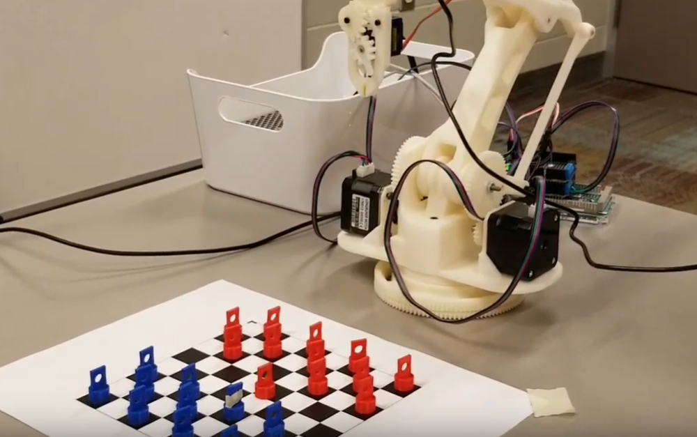
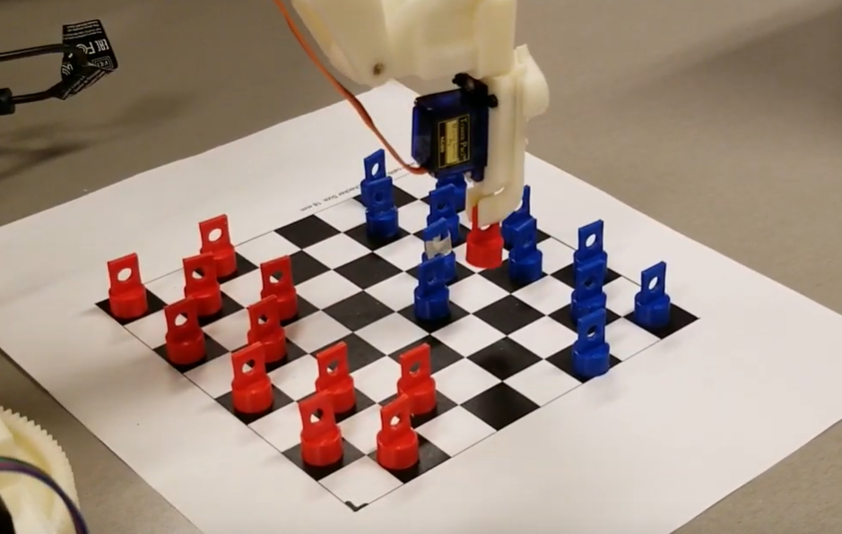

# quba_robotic_arm
**Quba** is a robotic arm that plays Checkers. 
Nigel was responsible for kinematics and motor control. Wendi was responsible for vision recognition. Bryan and I were responsible for basic A.I. and game logic. 

# Images

  
